# Competitive Intelligence Demo

An end-to-end **competitive-intelligence workflow** built with **n8n, OpenAI web research, deterministic JavaScript rendering, GitHub, and GitHub Pages**.

The workflow researches a product and its competitors, generates a structured evidence artifact, renders a review dashboard, pauses for **human approval**, and publishes the exact approved dashboard to production.

## What this project demonstrates

- **AI for research and judgment** — competitive research is generated by an LLM with web search.
- **Deterministic processing** — JavaScript parses, validates, transforms, and renders the AI output.
- **Human-in-the-loop control** — nothing reaches production until a person approves it.
- **Configuration separated from logic** — product and competitor inputs live outside the workflow.
- **Evidence-first output** — the research prompt requires traceable sources and explicit uncertainty.
- **Versioned publishing** — review and production artifacts are committed to GitHub.

## Architecture

```mermaid
flowchart LR
    A[Schedule Trigger] --> B1[Fetch Config]
    A --> B2[Fetch Prompt Template]
    B1 --> C[Merge]
    B2 --> C
    C --> D[Build Research Prompt]
    D --> E[AI Research + Web Search]
    E --> F[Parse Research JSON]
    F --> G[Fetch Dashboard Template]
    G --> H[Render Draft Dashboard]
    H --> I[Get Existing review.html]
    I --> J[Prepare Review Commit]
    J --> K[Publish review.html]
    K --> L[Human Review]
    L --> M{Approved?}
    M -- No --> N[Stop]
    M -- Yes --> O[Fetch Approved Review]
    O --> P[Get Current index.html]
    P --> Q[Prepare Publish Commit]
    Q --> R[Publish index.html]
```



## Human review and publishing

The workflow deliberately separates **review** from **production**:

1. A new dashboard is committed to `review.html`.
2. n8n pauses at the **Human Review** step.
3. The reviewer opens the review dashboard and chooses **Approve** or **Reject**.
4. Reject stops the workflow.
5. Approve promotes the **exact reviewed HTML** to `index.html` without regenerating it.

Review dashboard:

`https://alkashef.github.io/competitive-intelligence-demo/review.html`

Production dashboard:

`https://alkashef.github.io/competitive-intelligence-demo/`

## Repository contents

| File | Purpose |
|---|---|
| `product_competitor.config` | Defines the product-owner perspective, product, category, deployment context, and competitors. |
| `research_prompt_template.md` | Evidence-first deep-research prompt and required JSON contract. |
| `dashboard_template.html` | Deterministic browser-side dashboard renderer containing the `__DASHBOARD_DATA__` injection token. |
| `review.html` | Latest generated dashboard waiting for or used in human review. |
| `index.html` | Approved production dashboard served by GitHub Pages. |
| `build-research-prompt.js` | Reads the config and injects its values into the research prompt template. |
| `parse-research-json.js` | Removes optional Markdown fences and validates/parses the model response as JSON. |
| `render-draft-dashboard.js` | Injects the research JSON into the deterministic dashboard template. |
| `prepare-review-commit.js` | Base64-encodes the draft dashboard and prepares the GitHub body for creating/updating `review.html`. |
| `prepare-publish-commit.js` | Prepares the GitHub commit that promotes the exact approved `review.html` content to `index.html`. |
| `README.md` | Project overview and architecture. |

## JavaScript Code nodes

### `build-research-prompt.js`

Used by **Build Research Prompt**.

It:

- parses `product_competitor.config`
- replaces `{{OWNER}}`, `{{PRODUCT}}`, `{{CATEGORY}}`, `{{DEPLOYMENT}}`, and `{{COMPETITORS}}`
- creates the final prompt sent to the research model

### `parse-research-json.js`

Used by **Parse Research JSON**.

It:

- removes optional ```json fences
- parses the response using `JSON.parse()`
- fails the workflow if the model output is not valid JSON

### `render-draft-dashboard.js`

Used by **Render Draft Dashboard**.

It injects the parsed research artifact into:

```text
__DASHBOARD_DATA__
```

inside `dashboard_template.html`.

The template then renders the dashboard deterministically in the browser.

### `prepare-review-commit.js`

Used by **Prepare Review Commit**.

It:

- reads the generated HTML
- Base64-encodes it
- includes the current GitHub file SHA when `review.html` already exists
- prepares the request body for the GitHub Contents API

### `prepare-publish-commit.js`

Used by **Prepare Publish Commit**.

It:

- reads the already-approved `review.html`
- preserves that exact content
- includes the current SHA of `index.html`
- prepares the production publish commit

## Current configuration

```ini
[perspective]
owner = Alibaba / Qwen
product = Qwen3.5-35B-A3B
category = Open-weight general-purpose conversational LLM
deployment = Local/self-hosted, including air-gapped environments
competitors = Mistral Small 4 | DeepSeek-V3.2 | GLM-5.2 | gpt-oss-120b
```

Changing the configuration changes the competitive-research target without changing the workflow logic.

## Research artifact

The research prompt requires machine-readable JSON covering:

- Competitive Position
- What Changed
- Product Snapshot
- Benchmark Scorecard
- Local Deployment & Efficiency
- Capability Matrix
- Competitor Deep Dives
- Ecosystem & Adoption
- Strategic Actions
- Evidence / Sources

The prompt requires evidence traceability, explicit `null` values where reliable information is unavailable, and comparability labels for benchmark results.

## Main technologies

- **n8n** — workflow orchestration
- **OpenAI model + web search** — competitive research
- **JavaScript** — parsing, validation, transformation, and publishing preparation
- **GitHub REST Contents API** — versioned review and production commits
- **GitHub Pages** — dashboard hosting
- **HTML/CSS/JavaScript** — deterministic dashboard rendering

## Required credentials

The n8n workflow requires:

- an OpenAI API credential
- a GitHub fine-grained personal access token with **Contents: Read and write** permission for this repository

Store credentials in **n8n Credentials**. Do not place API keys or tokens in repository files or Code nodes.

## GitHub Pages

GitHub Pages should be configured to deploy from:

```text
Branch: main
Folder: / (root)
```

`index.html` is therefore the production entry point.

## Current limitation / next improvement

`build-research-prompt.js` currently replaces `{{PREVIOUS_RUN_JSON}}` with `null`.

That means each run is effectively treated as a baseline for change detection. To fully implement recurring **What Changed** analysis, the workflow should persist the previous approved research JSON (for example as `latest.json`), fetch it at the beginning of the next run, and inject it into `{{PREVIOUS_RUN_JSON}}`.

## Design principle

The workflow intentionally assigns each job to the right mechanism:

> **AI researches and reasons. JavaScript handles deterministic transformation. Humans approve consequential publication. n8n orchestrates the process.**
